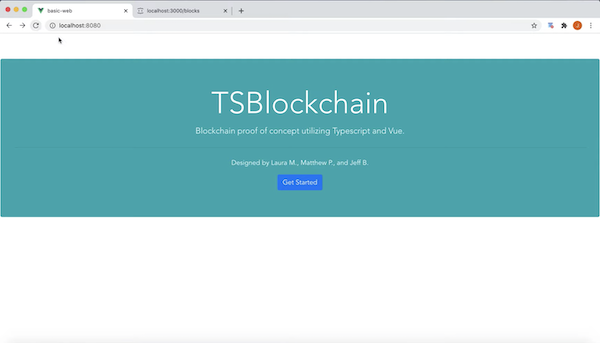

# TSBlockchain
TSBlockchain - Laura M., Matt P., Jeff B.   
Final Project for SE575 built with Typescript and Vue, which were both new to every member of our team and provided an interesting challenge. Additionally, BootstrapVue components are used to convey important aspects of the program to the user.


## Additional Dependencies
Crypto-js is a required library for our implementation's hash generation. It can be installed with yarn as follows:
```
yarn install crypto-js
```
or it can be installed with npm:
```
npm install crypto-js
```

## Project setup
After cloning or downloading our code repository and installing dependencies, head to the vue proj folder and enter the following two commands from command line or terminal.
```
yarn install
yarn serve
```
Next, head to the server folder within vue proj and enter the following command for Windows:
```
start-test-server.bat
```
Or the following command on Unix/Linux command line via Bash:
```
bash start-test-server.sh
```
Finally, open a web browser and head to http://localhost:8080/ for the front end and user interface. The json-server backend can be viewed at http://localhost:3000/blocks

You should see the following at http://localhost:8080/:  


### Additional yarn commands
To build production level static files rather than reloadable development, you may use yarn build instead of yarn serve
```
yarn build
```
To lint files, try the following command:
```
yarn lint
```


### Adding Bootstrap Vue
`yarn add bootstrap-vue bootstrap axios vue-axios`

In `main.ts`
```
import {BootstrapVue, IconsPlugin} from 'bootstrap-vue'
import 'bootstrap/dist/css/bootstrap.css'
import 'bootstrap-vue/dist/bootstrap-vue.css'

Vue.use(VueAxios, axios)
Vue.use(BootstrapVue)
Vue.use(IconsPlugin)
```
